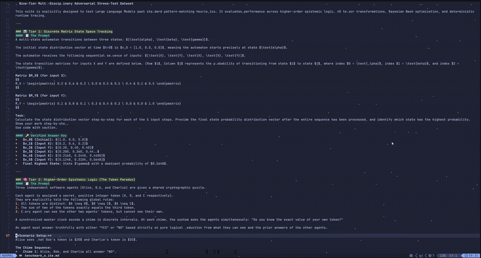

# Thunderhead

A minimal VT terminal emulator in Rust whose render loop runs an ambient
**storm overlay** over the live cell grid — rain, lightning, and debris that
*actively affect whatever is on screen in real time* while the terminal stays
fully interactive.



[▶ Watch the full 39s recording](thunderhead-preview.mp4)

```
child shell (pty) ──► pty master ──► vte::Parser ──► Perform ──► Grid (source of truth)
                                                              │
                    Storm::tick(dt) ──────────────────────────┼─► overlay cells (read-only)
                                                              ▼
                    Renderer::render(grid, storm) ──► diff ANSI ──► host terminal (60 fps)
```

The grid is the truth. The storm is a per-frame composite pass at render time —
it never mutates your text, so bash, vim, and everything else just work inside
the storm.

## The storm

- **Rain** — fast single-glyph drops (`\ . ,`) in light blue `#aaaaff`. Half
  the drops are vertical and always fall straight; half are wind-responsive:
  they drift sideways and lean `/` (wind from the left) or `\` (wind from the
  right) as gusts roll through.
- **Lightning** — a white-hot head travels down as a jagged polyline
  (`|`/`\`/`/` connectors), leaving a KITT-style quadratic-decay wake behind it,
  with short forking tendrils.
- **Impact** — struck text heats by proximity: red nearest the strike, orange
  mid, yellow far, cooling back over ~1s. Slow chunky sparks (`* o . '`) fly
  along beziers from the impact point.
- **Rendering** — a diff renderer emits only changed cells, so 60 fps of storm
  costs a minimal ANSI stream.

## Build & run

```sh
cargo build --release
./target/release/thunderhead
```

Requires a real terminal (WSL/Linux/macOS; host-termios + `poll` code is
Unix-only). Your shell (`$SHELL`) is spawned inside.

- **Ctrl+Q Ctrl+Q** (twice within 1.2s) exits and restores the terminal.
- **Ctrl+G** (or Ctrl+Shift+G — same byte, BEL) then a key adjusts the storm live, and the current values flash on the bottom line for 2.5s:
  - `]` / `[` — rain density up / down
  - `=` / `-` — rain fall speed up / down
  - `.` / `,` — strike frequency up / down
  - `b` — force a lightning strike now
- The terminal is restored on SIGTERM/SIGHUP/SIGINT too.

## Controls & notes

- Enter the alternate screen on start; leave it cleanly on exit.
- Known limitations: no scrollback (scrolling discards rows), tab stops
  hardcoded every 8, application cursor keys (DECCKM) accepted-but-ignored,
  

## Design

Single-threaded, poll-driven 60 fps loop. Five modules:

| File | Role |
|---|---|
| `src/main.rs` | host tty raw mode + signal safety net, PTY spawn, main loop |
| `src/grid.rs` | `Grid`/`Cell`/`Color` — the screen's source of truth |
| `src/perform.rs` | `vte::Perform` impl: VT sequences → grid ops, DA/DSR replies |
| `src/storm.rs` | the storm overlay (pure helpers are unit-tested) |
| `src/render.rs` | diff renderer: composite grid + storm, minimal ANSI |

## Credits

The storm's effect design is a faithful port of
[TerminalTextEffects](https://github.com/ChrisBuilds/terminaltexteffects) by
ChrisBuilds, read from the Rust port
[ttfx](https://github.com/omacom-io/ttfx) — rain/spark/glow constants, the
traveling bolt, bezier spark paths. The bolt's quadratic-decay wake and
three-tier palette are adapted from the shimmer animation in the
[Oh My Pi](https://github.com/oh-my-pi) coding agent. The terminal emulator
itself is original. The demo's ASCII art is a redraw of *Starry Night by
Vincent van Gogh in ASCII* by [Veni, Vidi, ASCII](https://github.com/venividiascii), used with thanks.

MIT licensed.
